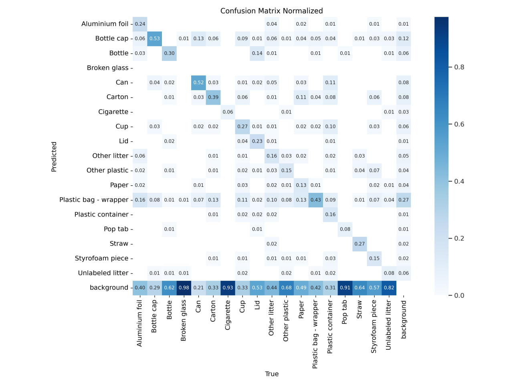
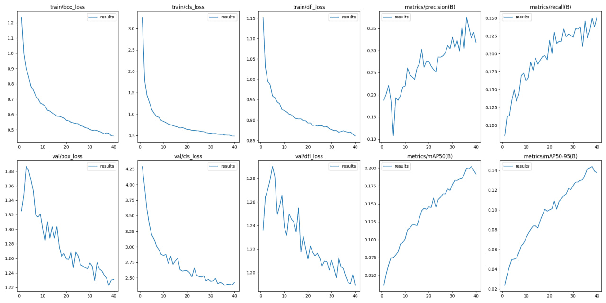
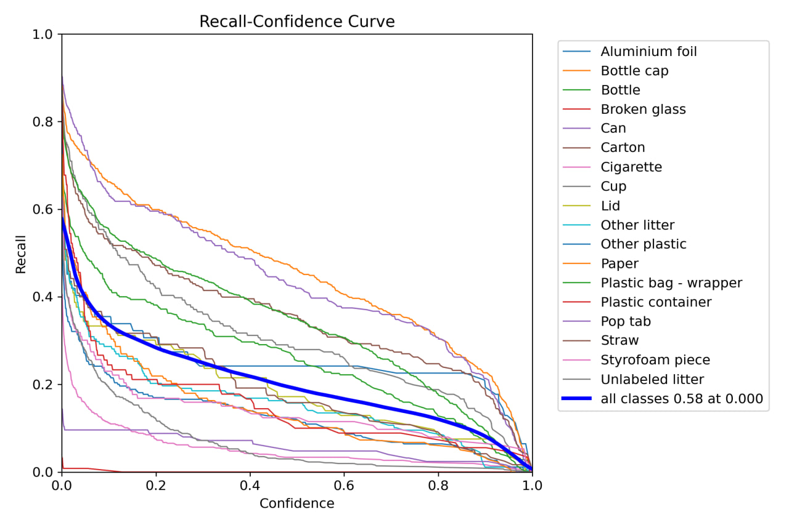
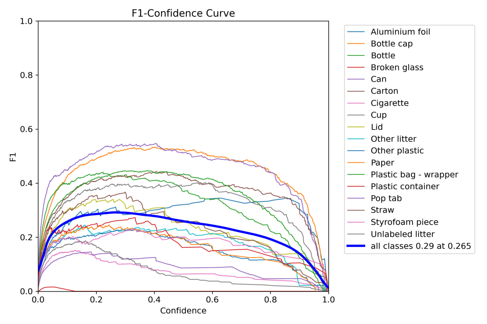
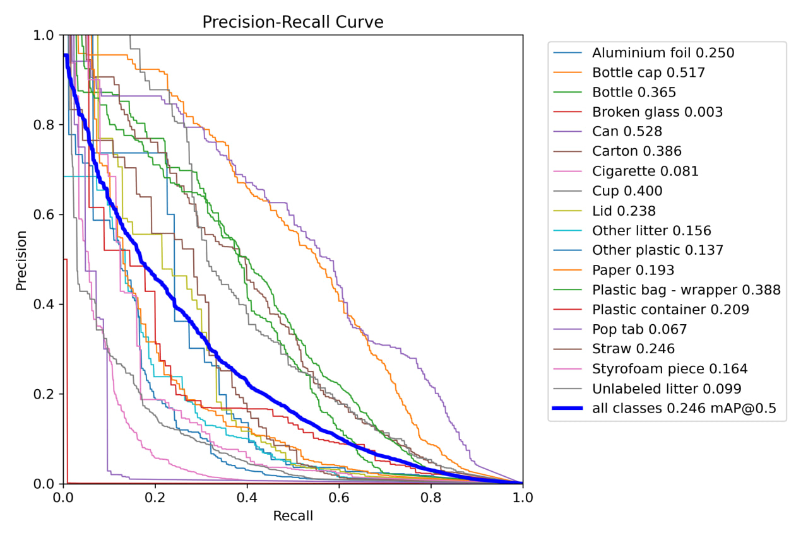

# EcoSortTech

## Description

This is a project for my EcoSortTech pet project. 
It allows users to sort their waste into different categories using a camera and a neural network model.
In this repo, I'm training YOLO v8 model to detect waste items in the image and classify them.

## Results

- Confusion Matrix
    

- Loss
    

- Recall/Confidence curve
    

- F1-Confindence curve
    

- Precision/Recall curve
  

  
## Dataset

The dataset used for training the model is the [TACO](http://tacodataset.org/) dataset.

